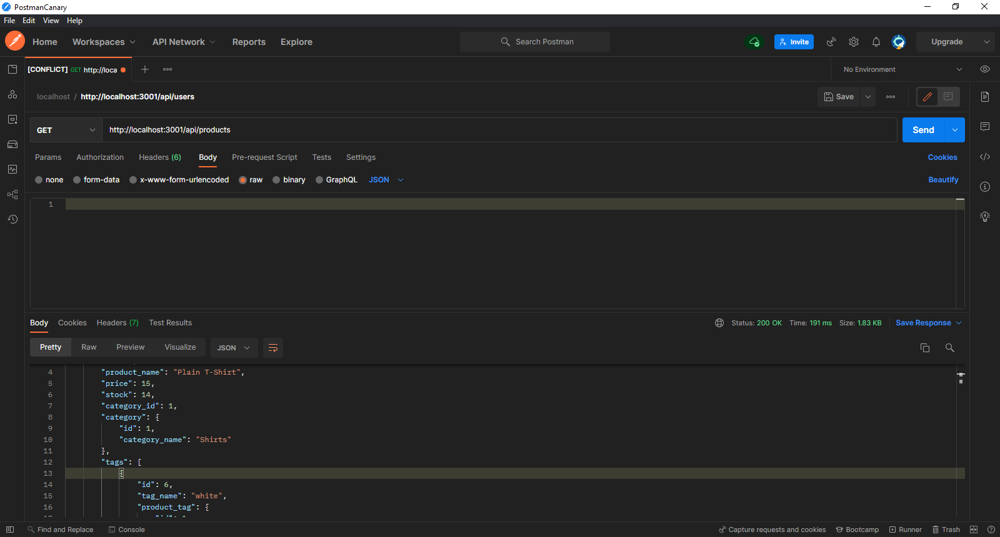

# e-commerce-backend

## Table of Contents
* [Description](#Description)
* [Installation](#Installation)
* [Usage](#Usage)
* [Questions](#Questions)
* [Credits](#Credits)

## Description
E-Commerce Backend is a simple backend API designed to help store owners store, update, and delete products, product categories, and product tags (descriptive key words). The languages and technologies used to build this application are JavaScript ES6+, Node.js, MySQL, MySQL2, Express.js, & Sequelize. 

## Usage
Here is a video demonstration of how to use this app:

## Installation
To use this API the user will need to clone this repository to their machine.

## Questions
If you have any questions about this project, please contact me via my GitHub: https://github.com/garretthilberling

## Credits
This project was created solely by Garrett Hilberling: https://www.linkedin.com/in/garretthilberling/
    
